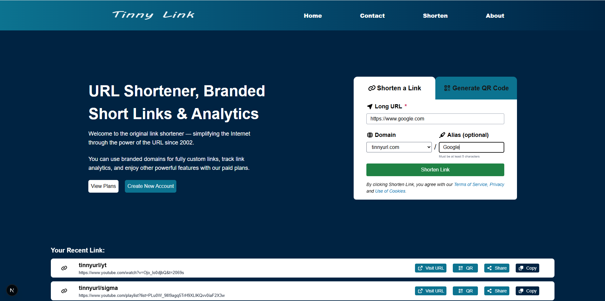

# 🔗 Tinny Link — URL Shortener

Tinny Link is a modern **URL shortener web application** built with **Next.js (App Router)** and **MongoDB**.  
It allows users to generate short links, manage aliases, and instantly redirect to original URLs using dynamic routing.



> A clean, fast, and scalable URL shortening solution inspired by tools like TinyURL & Bitly.

---

## ✨ Features

- 🔗 **Shorten long URLs**
- ✏️ **Custom alias support**
- 🚀 **Instant redirection using dynamic routes**
- 📋 **Recent links list (long + short)**
- 🔁 **No page reloads (React state updates)**
- 🧠 **Duplicate alias prevention**
- ⚡ **Server-side redirects (SEO friendly)**
- 📱 **Responsive & modern UI**
- 🔐 **MongoDB-backed persistence**

---

## 🛠 Tech Stack

**Frontend**
- Next.js 14 (App Router)
- React
- Tailwind CSS
- FontAwesome Icons

**Backend**
- Next.js API Routes
- MongoDB (Native Driver)

**Other**
- Dynamic routing (`app/[shorturl]/page.js`)
- Server-side redirects (`redirect()`)

---

## 🚀 Getting Started

### 1️⃣ Clone the repository
```bash
git clone https://github.com/your-username/tinny-link.git
cd tinny-link

npm install

Create a .env.local file
MONGODB_URI=mongodb://localhost:27017/TinnyURL
*Note: Make sure MongoDB is running locally or update the URI for Atlas.*

npm run dev

Run the app
http://localhost:3000

```
---
## 🧪 Example Use Case

### Long URL:

https://www.youtube.com/watch?v=Ojo_lo0djbQ


### Short URL:

http://localhost:3000/yt

---
## 🧠 Best Practices Used

All hooks declared at top-level

Server-side redirects for performance

State-based UI updates (no refresh)

Clean separation of client & server logic

Hydration-safe layout

---

## 🔮 Future Enhancements

📊 Click analytics

🗑 Delete / edit links

📎 Copy to clipboard

📱 QR code generation

🌐 Custom domain support

🔐 Authentication & dashboard

---

# 👨‍💻 Author

### Aman Singh Sikarwar
Built as a learning & portfolio project using modern full-stack practices.

